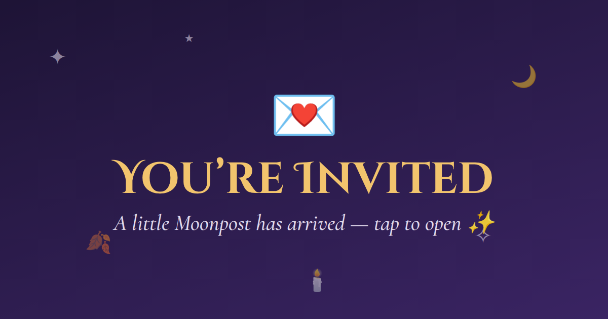

# Moonpost ✉︎☾

Whimsical, themed invitations for dates and events that you **send by text**.
The recipient taps the link, breaks the wax seal, RSVPs, adds the event to
their calendar, and texts their answer back to you.



## How it works

1. **Build it.** Pick an occasion (dinner date, drinks, a night out dancing,
   game night, birthday, Halloween party, after dark, royal feast, cat date, picnic, sabbat gathering…), fill in the basics, choose a look, and add only the
   details that matter.
2. **Seal it.** Moonpost packs the whole invitation into the link itself.
   There's no server, database or account. The link is then shortened with
   [is.gd](https://is.gd) (or v.gd), so it looks like `is.gd/aB3xYz`.
3. **Send it.** Tap **📋 Copy message** and paste your note and the link into a
   text (or anywhere else), or use **Share…**.
4. **They open it.** They see your invitation arrive (an envelope, a scroll,
   a message in a bottle, a treasure chest or a gift box), tap to crack your
   wax seal, and watch it open into the card.
5. **They answer.** A yes gets a little celebration, answers to any questions
   you asked, and **Add to calendar** buttons (Apple/iPhone, Google, Outlook,
   .ics). **Text my answer** opens their messages app with the reply already
   written (they pick you as the recipient), or they can copy it.

## Occasion vs. look

- **The occasion** sets the *words* and the *lettering*: the banner, greeting,
  RSVP button wording and sign-off, plus a matching font pairing. You can swap
  the lettering for any of 16 pairings (storybook, elegant script, blackletter,
  old manuscript, art deco, neon, spooky, scrawl, celtic, playful, kitten…).
- **The look** sets the *colors* and materials. Looks are grouped into tabs:

| Tab | Looks |
|---|---|
| 🌹 Romantic | Candlelit · Blush & Gold · Midnight Velvet |
| 🍂 Seasonal | the eight sabbats: Samhain, Yule, Imbolc, Ostara, Beltane, Litha, Lughnasadh, Mabon |
| 🌿 Nature | Garden Picnic · Wild Adventure · Enchanted Forest · Seaside |
| 🏰 Medieval | Royal Court · Castle Keep · Illuminated |
| 🐈‍⬛ Cats | Black Cat · Calico · Kitten Pastel · Cat Café |
| 🎉 Parties | Speakeasy · Neon Club · Disco Fever · Game Night · Birthday Bash · Tiki Bar · Celebration |
| 🖤 Dark side | Gothic · Emo · Halloween · Kinky |
| ✨ Night & glam | Starlit Night · Night at the Show · Cozy Night In |

Each look also picks sensible defaults for everything below, and you can
override any of them:

- **Colors:** the page (card) color and the background colors can each be
  changed on their own. A custom page color keeps text and titles readable.
- **Neon glow:** make the title, headings and card edge glow in hot pink,
  electric blue, lime, ultraviolet, tangerine, lemon, red, white or any color.
- **Background:** a soft glow, a moonlit sky, a velvet curtain, bokeh lights,
  a neon grid, a sunburst, or a pattern (damask, stars, snowfall, blossoms,
  leaves, hearts, paw prints, waves, castle stone, gingham, plaid, lace, bats,
  spiderwebs, stripes, cocktails, dice, checkerboard, disco tiles, music notes, confetti), in the look's
  colors or two of your own.
- **Paper:** smooth card, handmade cotton, aged parchment, linen weave,
  watercolor wash, marble, kraft, vellum, silk, leather, speckled or shimmer.
- **Ornaments:** corner pieces (filigree, gothic, floral vine, art deco,
  celestial, paw prints), side borders (double frame, climbing vine, pearls,
  stitching, paw trail) and script lines between sections (swash, flourish,
  vine, fine rule).

## Wording

Every line of text is editable in step 7: the words above and below the
envelope, the banner, salutation, greeting, moon line, reply-by line, closing,
the RSVP question and buttons, and what they see after answering. Clear a line
to hide it. Detail labels (e.g. "What to wear" → "Attire") can be renamed too.

Every card shows the **moon phase** for that night and the month's traditional
moon name (e.g. "🌕 Beneath the full Hunter's Moon"), and notes when the date
falls on a sabbat. The **Sabbat gathering** occasion uses the wording of the
season the date falls in.

## Delivery & wax seals

**Delivered as:** each wrapper is dressed in the look's colors and pattern
(envelope liners, gift wrap…), and the seal cracks in two with a burst of
sparks when tapped:

| | Opening |
|---|---|
| ✉️ Envelope | gold-foil edged paper with a patterned liner and a botanical sprig under the seal; the flap swings open and an illuminated letter slides out |
| 📜 Scroll | parchment rolled on dowels with gilded finials, tassels and a satin ribbon; it unrolls into an illuminated page |
| 🍾 Message in a bottle | sea glass with sand, a starfish and twine on the neck, bobbing on foamy waves; the cork pops and the ribboned note rises out |
| 🧰 Treasure chest | planked wood with gilded straps, brackets and a jewelled lid; the seal is the lock, and the lid tips back to reveal velvet, gold coins and gems |
| 🎁 Gift box | patterned wrap, stitched satin ribbons, a full bow and a gift tag; the bow unties, the lid tumbles off, and the letter rises from tissue paper |

**Wax seal:** an SVG seal with an irregular wax spill, a raised rim and a
stamped emblem. Choose the wax (16 shades including metallic gold, copper,
bronze and silver, or any color), the emblem's finish (pressed into the wax,
gold leaf, silver, copper, rose gold, bronze, pearl, jet, or any color), and
the emblem: regal (crown, fleur-de-lis, shield, crossed swords, castle,
laurel, key, chalice, knight, lion, dragon…), love, celestial, nature, party, dark (bat,
broken heart, skull, kiss…)
(martini, die, music, disco ball, cake…) or cats (sitting cat, cat face,
paw print…). Or press your own initials or symbol (up
to 4 characters, emoji included).

## Detail modules

Add any of these to an invitation. Each one has quick-pick suggestions, or you
can write your own:

👗 What to wear · 🎨 Color palette · 🎒 What to bring · 🍽️ Food & drink ·
💸 Cost · 🚗 Getting there · 🅿️ Parking · 🌦️ Weather & terrain ·
🥾 Activity level · ✨ The vibe · 🎁 Surprise level · 👯 Who's coming ·
🐾 Kids & pets · ♿ Accessibility · 🔗 Link (tickets, menu, playlist) ·
📝 Good to know · ⏳ Please reply by

You can also add **custom fields** (pick an emoji, a label and a value, like
"🔑 Secret password: Moonbeam") and **questions for them** (allergies, drink of
choice, song request, pickup spot, or your own). Their answers come back in
the reply text.

## Running it

It's plain HTML, CSS and JavaScript modules, with no build step.

```sh
npm start        # serves at http://localhost:8080
npm test         # runs the unit tests (Node 18+)
```

(Any static server works, e.g. `python3 -m http.server`. Opening
`index.html` directly as a file won't work, because browsers block JS
modules over `file://`.)

## Putting it online (free)

The included workflow tests the app and publishes it to **GitHub Pages**
whenever `main` changes:

1. Merge this into `main`.
2. In the repo, go to **Settings → Pages → Build and deployment** and set
   **Source** to **GitHub Actions**.
3. Your app will be live at `https://ddraigfawr13.github.io/Date-Request-App/`.

Links you send only work from the deployed site, since the invitation is
opened on whatever address made it. Build invitations from the live URL, not
localhost.

## Privacy notes

- The invitation lives in the part of the URL after `#`, which browsers never
  send to a server. Anyone *with the link* can read it, though, so share
  it like you would the text itself.
- Short links are made by is.gd, which stores the full link (and so can see
  the invitation). If it can't be reached, Moonpost gives you the full link
  instead.
- No phone numbers are stored. RSVPs aren't collected anywhere; they arrive as
  a normal text message from your guest.

## Project layout

```
index.html          page shell (builder + invitation views)
css/styles.css      all styling, including envelope & particle animations
js/app.js           routes between builder and invitation (#i=…)
js/builder.js       the sender's form, live preview and "seal & send"
js/invite.js        the recipient's envelope, RSVP and replies
js/render.js        renders the invitation card (shared by both views)
js/themes.js        looks (colors & materials), Wheel of the Year and moon phases
js/occasions.js     occasions (wording, lettering), font pairings, editable lines
js/decor.js         backgrounds, patterns, paper, corner/side ornaments, script lines
js/seal.js          the SVG wax seal, wax colors, finishes and emblems
js/wrappers.js      delivery styles (envelope, scroll…) and their animations
js/wrapper-art.js   hand-drawn SVG detail for the envelope, bottle, chest and gift
js/shorten.js       short links via is.gd / v.gd
js/modules.js       detail modules and questions
js/calendar.js      .ics / Google / Outlook calendar links
js/codec.js         packs the invitation into the link (compressed)
tests/              unit tests (node --test)
```

### Adding your own look or occasion

- **Look:** add an entry to `THEMES` in `js/themes.js` with a `cat` from
  `LOOK_CATEGORIES`, and it shows up under that tab automatically.
- **Occasion:** add an entry to `TEMPLATES` in `js/occasions.js` with its
  wording, font pairing and the details it should pre-fill.
- **Detail module:** add an entry to `MODULES` in `js/modules.js`.

## Ideas for later

- A tiny backend (e.g. a Cloudflare Worker) for our own short links, photo
  backgrounds, per-invite link previews, and an RSVP dashboard.
- Photo or GIF header on the card.
- Multi-guest invitations with a headcount.
- Month-specific flourishes (birth flowers, birthstones) layered on the
  seasonal theme.
